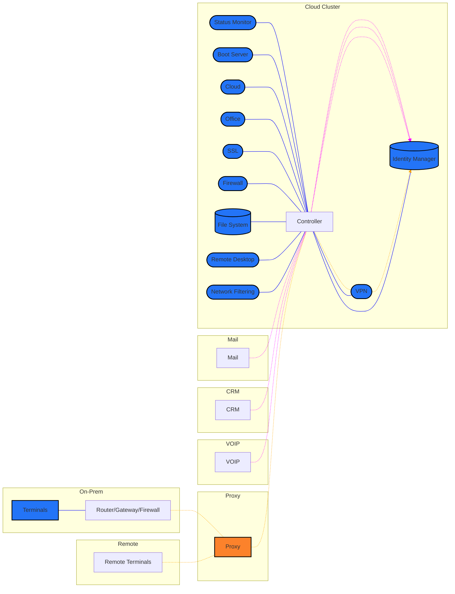
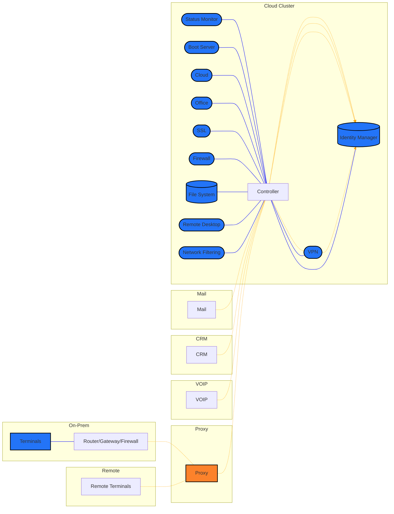
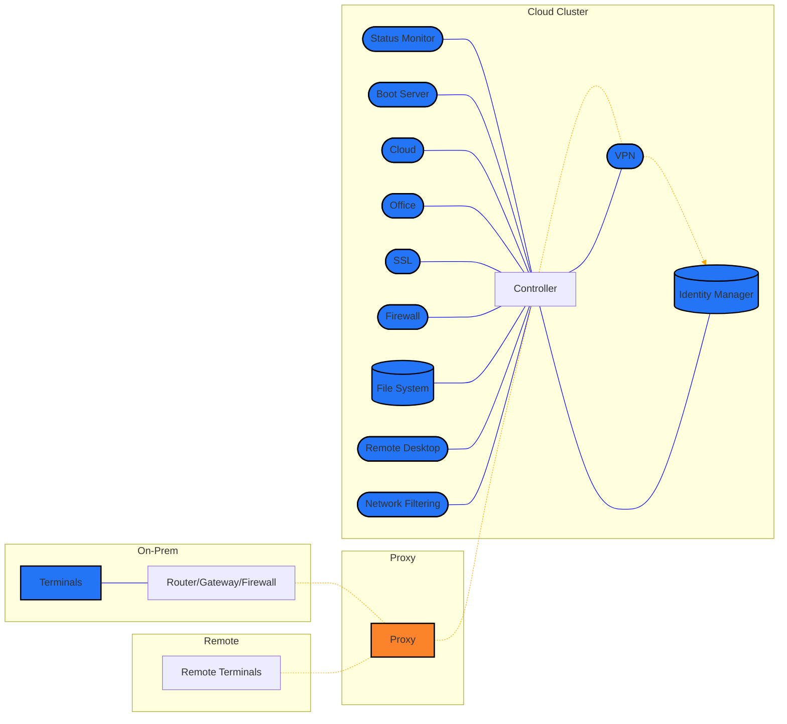

## ARCHITECTURE
**N.B.**: The word terminal shall be used in the following diagrams to represent client devices; phones or computers.

Where:
- **Blue**: Internal Connectivity
- **Magenta**: Un-proxied Connection
- **Orange**: Secure, proxied connection

All cluster pods' images are created to be atomically ephemeral and are running with de-escalated privilidges to provide the latest stable and secure experience. Same holds for OS images deployed via the `boot server` for use by the terminals.
### MODEL A; User Account Mirroring

### MODEL B; Active SSO - No Duplication | RECOMMENDED

### MODEL C; SEPARATE BACKEND

